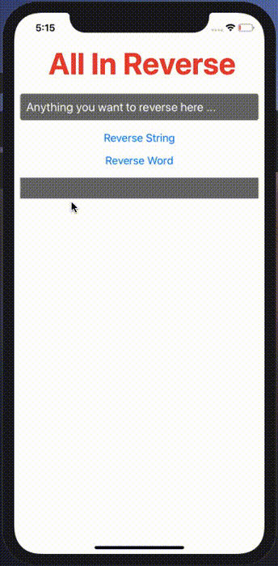
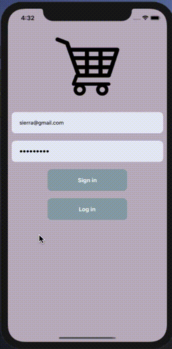
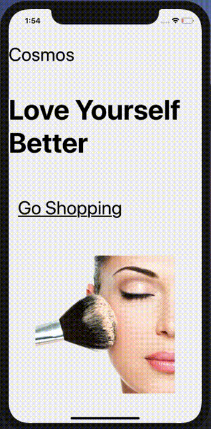

### Hi there 👋

- 🔑 -> I’m currently working as a Freelancer
- 📲 -> I’m currently learning React_Native
- 🌈 -> I’m looking to collaborate on Software Development
<!-- - 🤔 I’m looking for help with social Projects
- 💬 Ask me about anything -->
- 🔥 How to reach me: ...
<a href= "https://www.linkedin.com/in/aydin-sanoz-93411970/" target="_blank">
    

<!-- 

 -->
  
<!-- - 😄 Pronouns: ... -->
- Fun Fact: 🎾 Tennis, 🤿  ScubaDiving, 🏀 Basketball, 🏊‍♀️Swimming
-->

I am Aydın . I interested always creating new world with codes. Now I started to my new career and my dream with Clarusway. Besides I am learning new It skills  here and creating my new Projects too. 

I am looking forward to produce social projects which are very helpful for good people. 

Also working as a freelancer.

---

## Especially interested skillsets 🔥

- HTML
- CSS
- JAVASCRIPT
- REACT-NATIVE
- REACT-JS
  

---
  
### Some Of ScreenShots in my repositories 🔥
|P0001|P0002|P0003|P0004|P0005|P0006|
|---|---|---|---|---|---|
|||||||
|P0007|P0008|P0009|P0010|P0011|P0012|
|||||

---

 💻  @ Happy Coding @ 💻 

<!--
**AydinSanoz/AydinSanoz** is a ✨ _special_ ✨ repository because its `README.md` (this file) appears on your GitHub profile.

Here are some ideas to get you started:

- 🔭 I’m currently working on ...
- 🌱 I’m currently learning ...
- 👯 I’m looking to collaborate on ...
- 🤔 I’m looking for help with ...
- 💬 Ask me about ...
- 📫 How to reach me: ...
- 😄 Pronouns: ...
- ⚡ Fun fact: ...
-->
